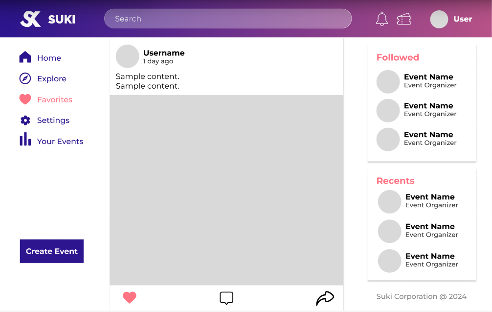
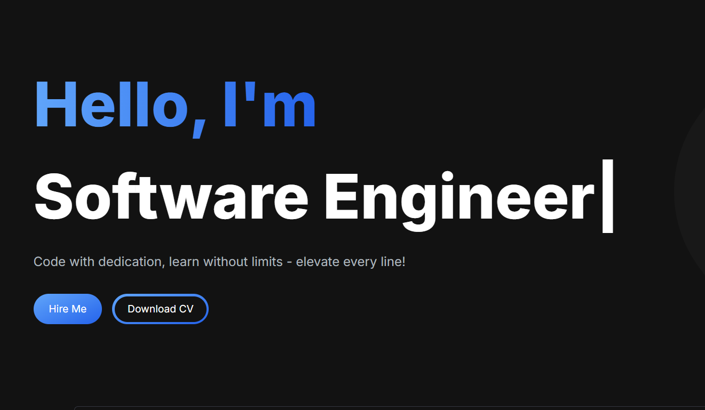
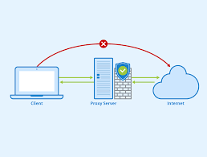
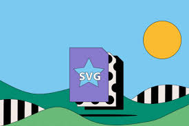
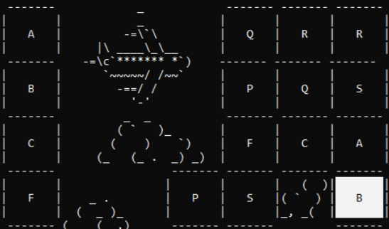

# Portfolio
# Portfolio

## Table of Contents
- [Introduction](#introduction)
- [Projects](#projects)
- [Contact](#contact)

## Introduction
Welcome to my portfolio! This project showcases various projects I have worked on, including web applications, mobile applications, and desktop applications.

## Projects
### Event Website
- **Description**: MERN Stack Project with RESTFUL API
- **Tags**: All, Web
- **GitHub**: [Event Website](https://github.com/Nhannguyenus24/Event-Website)
- **Image**: 

### Portfolio Website
- **Description**: NextJs Project
- **Tags**: All, Web
- **GitHub**: [Portfolio Website](https://github.com/Nhannguyenus24/Portfolio)
- **Image**: 

### Proxy Server
- **Description**: Simple Python Proxy between Browser and Server
- **Tags**: All, Window app
- **GitHub**: [Proxy Server](https://github.com/Nhannguyenus24/Website-proxy)
- **Image**: 

### SVG Drawer
- **Description**: SVG Reader file and Drawing Window app
- **Tags**: All, Window app
- **GitHub**: [SVG Drawer](https://github.com/Nhannguyenus24/SVG-Reader)
- **Image**: 

### Pikachu Onet Game
- **Description**: Simple onet Window app
- **Tags**: All, Window app
- **GitHub**: [Pikachu Onet Game](https://github.com/Nhannguyenus24/HCMUS-Onet-Game-Project)
- **Image**: 

## Contact
If you have any questions or would like to get in touch, please feel free to contact me.

- **Email**: [Your Email](mailto:your-email@example.com)
